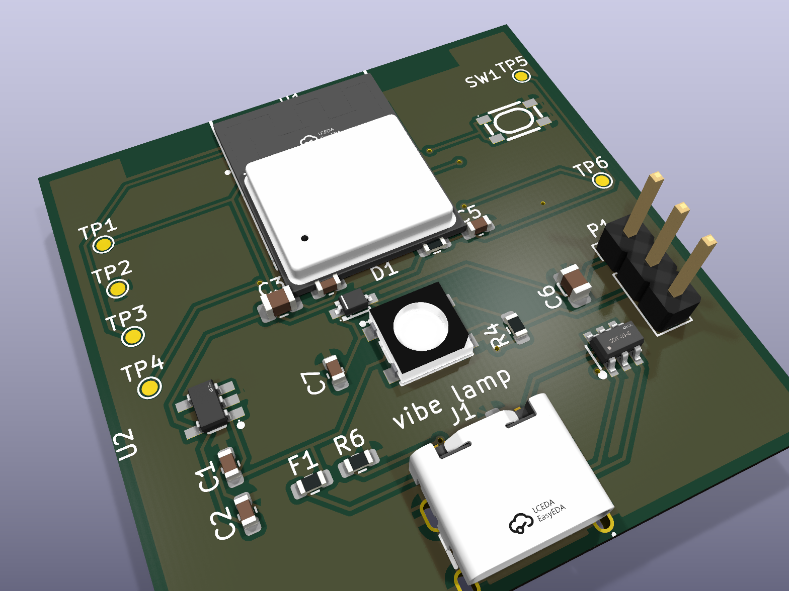

# Vibe Lamp · 硬件上手指南

这是一份「从硬件到灯随会话变色」的分步清单。Core V1 PCBA 是推荐路径；面包板原型保留给快速验证和固件调试。

> 命令里的 `pio` / `python` 可直接用仓库自带虚拟环境：
> - `/Users/laofahai/Documents/workspace/vibe-lamp/.venv/bin/pio`
> - `/Users/laofahai/Documents/workspace/vibe-lamp/.venv/bin/python`
>
> 下文为简洁起见写成 `pio` / `python`，把它换成上面的绝对路径即可（或先 `source .venv/bin/activate`）。

---

## 0. 你需要什么

两条路任选其一往下走：

- **Core V1 PCBA（推荐）**：使用本仓库 KiCad 工程和 `fab/` 里的 JLCPCB 文件下单，收到的是工厂贴好的主控板。用户不需要焊接主板，只需要 USB-C 烧录、配网、装外壳。
- **面包板原型**：用 ESP32 开发板、RGB LED 或 WS2812 灯环快速验证固件和灯效。

Core V1 生产资料：

| 文件 | 用途 |
|---|---|
| `hardware/kicad/vibe_lamp_core_v1/vibe_lamp_core_v1.kicad_pcb` | KiCad PCB 源文件 |
| `hardware/kicad/vibe_lamp_core_v1/renders/` | PCB 3D 渲染图 |
| `hardware/kicad/vibe_lamp_core_v1/fab/vibe_lamp_core_v1-gerber.zip` | JLCPCB Gerber 上传包 |
| `hardware/kicad/vibe_lamp_core_v1/fab/vibe_lamp_core_v1-bom.csv` | JLCPCB 贴片 BOM |
| `hardware/kicad/vibe_lamp_core_v1/fab/vibe_lamp_core_v1-cpl.csv` | JLCPCB 贴片坐标 |
| `hardware/v1_routing_status.md` | 布线、DRC、下单注意事项 |

<p align="center">
  
</p>

### 物料清单 A — 打样版（单颗共阴 RGB LED）

| 物料 | 数量 | 备注 |
|---|---|---|
| ESP32 开发板 | 1 | 手上现成的即可（`esp32dev`） |
| 共阴 RGB LED（4 脚） | 1 | 一个公共**阴极** + R/G/B 三脚 |
| 限流电阻 ~220Ω | 3 | R/G/B 各一颗 |
| 面包板 | 1 | |
| 杜邦线 | 若干 | |
| USB 数据线 | 1 | 烧录 + 供电 |

### 物料清单 B — 进阶版（WS2812 灯环）

| 物料 | 数量 | 备注 |
|---|---|---|
| ESP32 开发板 | 1 | |
| WS2812 / WS2812B 灯环（16 灯） | 1 | 可寻址，支持多会话分段 |
| 限流电阻 ~330Ω | 1 | 串在数据线 DIN 上 |
| 电解电容 ~1000µF | 1 | 并在 5V 与 GND 之间，护电源 |
| 杜邦线 | 若干 | |
| USB 数据线 | 1 | |

> 引脚以固件 `firmware/include/config.h` 的实际值为准（下面接线表已对齐）。换板/换脚改 config.h 即可，不用动业务代码。

---

## 1. 接线

### 1. Core V1 PCBA（推荐）

Core V1 的 ESP32-C3-MINI-1、USB-C、WS2812B、清网按钮、电阻电容都在工厂贴片完成。主板本身不需要用户接线。

连接关系见 `hardware/v1_wiring_diagram.svg`：

- USB-C 输入 5V，板上 LDO 输出 3.3V 给 ESP32-C3。
- 板载 D1 是 WS2812B 数字灯，`GPIO4 → R4(330Ω) → D1.DIN`。
- D1 的供电经过 D3 形成 `LED5V`，降低 WS2812B 输入高电平门槛，让 ESP32-C3 的 3.3V GPIO 稳定驱动。
- SW1 清网按钮接 `GPIO10` 到 GND，固件内部上拉。
- P1 预留外接 WS2812 灯环/灯带焊盘（5V、DATA、GND），D1 是链上第一颗。

如果只使用 Core V1 板载单灯，到这里就可以直接跳到第 2 节烧录。

### 1A. 共阴 RGB LED（打样版）

R/G/B 三脚各经一颗 ~220Ω 限流电阻接到 ESP32 对应 GPIO，公共阴极直接接 GND。

config.h 实际引脚：`PIN_RGB_R=25`、`PIN_RGB_G=26`、`PIN_RGB_B=27`。

```
  ESP32                              共阴 RGB LED
  ┌────────┐                         ┌──────────┐
  │ GPIO25 ├───[ 220Ω ]──────────────┤ R        │
  │ GPIO26 ├───[ 220Ω ]──────────────┤ G        │
  │ GPIO27 ├───[ 220Ω ]──────────────┤ B        │
  │   GND  ├─────────────────────────┤ 公共阴极  │ ← 最长那只脚
  └────────┘                         └──────────┘
```

接线要点：
- **共阴**：最长那只脚是公共**阴极**，接 GND。
- 三颗限流电阻别省，否则 LED 会过亮甚至烧。
- 如果你手上是**共阳** RGB LED（公共脚接 3.3V），公共脚改接 3.3V，并在固件驱动里把 PWM 占空比反相（`display_rgb_led.cpp` 里把每路写成 `255 - value`）。

### 1B. WS2812 灯环（进阶版）

config.h 实际数据脚：`PIN_WS2812=4`，`NUM_LEDS=16`。

```
  ESP32                        WS2812 灯环
  ┌────────┐                   ┌───────────┐
  │ GPIO4  ├──[ 330Ω ]─────────┤ DIN       │ ← 注意方向：接 DIN/IN，不是 DOUT
  │   5V   ├───────┬───────────┤ 5V / VCC  │
  │   GND  ├───┐   │           │           │
  └────────┘   │   │           └───────────┘
               │   │
               │  ═╧═  1000µF
               └───╨──┐
                  GND │
                      ▼ 并在 5V 与 GND 之间（注意电解电容极性）
```

接线要点：
- 数据线 DIN 串一颗 ~330Ω 电阻，削尖峰、护第一颗灯。
- 5V 与 GND 之间并一颗 ~1000µF 电解电容（**长脚正、短脚负，别接反**），吸收上电涌流。
- 认准灯环上的 **DIN / IN** 箭头方向，接反了不亮。
- 16 颗全亮电流不小，靠开发板 5V 供电够用；以后做长灯条要单独供电。

---

## 2. 烧录固件

插上 USB，进 firmware 目录烧录。

**Core V1 PCBA（板载 WS2812B，推荐）**：

```bash
cd firmware
pio run -e c3_core_v1 -t upload
```

**面包板打样版**（单颗 RGB LED，默认 env）：

```bash
cd firmware
pio run -e esp32 -t upload
```

**灯环版**用 `esp32_ring` env：

```bash
cd firmware
pio run -e esp32_ring -t upload
```

预期：PlatformIO 自动拉依赖（FastLED / ArduinoJson / WiFiManager），编译并烧录，最后打印 `SUCCESS`。

> 没插板也能验证工具链：把 `-t upload` 去掉只跑 `pio run -e esp32`，应编译 `SUCCESS`。

---

## 3. 配网（连 WiFi）

固件刷进去还不知道你家 WiFi 密码——**不需要手填任何文件**，开机自建热点用浏览器配。

1. 烧录后打开串口看日志：
   ```bash
   pio device monitor
   ```
   首次开机（NVS 里没凭据）串口会打印 WiFiManager 起配网门户的日志，ESP32 出现一个 WiFi 热点 **`VibeLamp-Setup-<后缀>`**（每台灯的热点名带自己 MAC 的后 6 位十六进制后缀，避免多台同名）。

2. 手机或电脑连上 `VibeLamp-Setup-<后缀>`（开放热点，无密码）。系统通常会**自动弹出配网网页**；若没弹，浏览器手动访问 `http://192.168.4.1`。配网页顶部会显示这台灯的**设备名 `vibelamp-<后缀>.local` 与 MAC**——记下它，多人同网时用来区分自己的灯。

3. 点 **Configure WiFi** → 选你家 WiFi → 填密码 → **Save**。

4. ESP32 自动重连并把凭据存进 NVS，串口回到：
   ```
   WiFi OK, http://vibelamp.local  IP=192.168.x.x
   ```
   （也能在路由器后台看到这台新设备上线。）

   > **设备名带 MAC 后缀**：mDNS 实际注册的是 `vibelamp-<后缀>.local`（如 `vibelamp-ab7834.local`），**不是**固定的 `vibelamp.local`——多人同网才不会撞名。上面串口横幅里打印的 `vibelamp.local` 不带后缀、未必能直接解析；最稳的是用串口里的 **IP**，或配网页/下文里的 `vibelamp-<后缀>.local`。

5. 在 Mac 上验证能解析到它（macOS 原生支持 `.local`）：
   ```bash
   ping vibelamp-<后缀>.local    # 把 <后缀> 换成你这台灯的实际后缀；或直接 ping 串口里的 IP
   ```
   能 ping 通即配网成功。

> **凭据持久 + 多网记忆**：拔电再上电不会再弹配网（凭据存 NVS，断电不丢）。固件把配过的网络都记进**自建多网表**（NVS 里的唯一真源），开机时扫描周围 AP、挑信号最强的已知网连接（兼容一个 SSID 多 AP 的 Mesh，多轮重试），连不上才重开配网门户。换网/搬家见下面第 8 节。

---

## 4. 手动点灯自测

不用装守护进程，直接用 `curl` 推状态，验证整条「HTTP → 渲染 → 灯」链路。逐条执行，看灯：

> **两个必带的 flag（否则常踩坑）**：
> - `-H 'Content-Type: application/json'` —— 不带的话 `curl -d` 默认按表单类型发送，固件解析不到 JSON 会返回 **400 bad json**。
> - `--noproxy '*'` —— 你的 Mac 若设了系统代理（HTTP_PROXY 等），curl 会把发往局域网灯的请求也走代理 → **502**。带上它强制直连。没设代理时它是无害的空操作，留着即可。
>
> 下面每条都已带上这两个 flag，复制即用。命令里的 `vibelamp.local` 是**占位符**——换成你这台灯的实际设备名 `vibelamp-<后缀>.local`（见第 3 节，配网页/串口里有）或它的 IP，否则解析不到。

```bash
# 干活中 → 蓝呼吸
curl --noproxy '*' -X POST http://vibelamp.local/state -H 'Content-Type: application/json' -d '{"sessions":[{"state":"working","tool":"code"}]}'

# 要你介入 → 红慢闪
curl --noproxy '*' -X POST http://vibelamp.local/state -H 'Content-Type: application/json' -d '{"sessions":[{"state":"needs_you"}]}'

# 完成 → 绿亮后渐暗
curl --noproxy '*' -X POST http://vibelamp.local/state -H 'Content-Type: application/json' -d '{"sessions":[{"state":"done"}]}'

# 出错 → 红快闪一下后弹回
curl --noproxy '*' -X POST http://vibelamp.local/state -H 'Content-Type: application/json' -d '{"sessions":[{"state":"error"}]}'

# 看设备健康状态（返回会话数、运行时长）
curl --noproxy '*' http://vibelamp.local/health
```

工具分色（`working` 状态下试不同 `tool`）：

```bash
# 写码=蓝
curl --noproxy '*' -X POST http://vibelamp.local/state -H 'Content-Type: application/json' -d '{"sessions":[{"state":"working","tool":"code"}]}'
# 跑命令=紫
curl --noproxy '*' -X POST http://vibelamp.local/state -H 'Content-Type: application/json' -d '{"sessions":[{"state":"working","tool":"command"}]}'
# 搜索=青
curl --noproxy '*' -X POST http://vibelamp.local/state -H 'Content-Type: application/json' -d '{"sessions":[{"state":"working","tool":"search"}]}'
```

**失联自测**：推一条状态后，**停 30 秒不再发**。看门狗超时后灯会转为**琥珀色慢呼吸**（失联态）。再推任意一条 `/state`，灯立即恢复正确显示。

> 灯环版还能验证多会话分段——一次推两个会话，前半圈一个状态、后半圈另一个：
> ```bash
> curl --noproxy '*' -X POST http://vibelamp.local/state -H 'Content-Type: application/json' \
>   -d '{"sessions":[{"state":"working","tool":"code"},{"state":"needs_you"}]}'
> ```
> 预期：前半圈蓝呼吸、后半圈红慢闪。

---

## 5. 接入真实会话

灯能被 `curl` 点亮后，把它接到真实的 Claude Code / Codex 会话。守护进程会把 agent 钩子事件合并成状态，自动推给灯：

```bash
cd daemon
python install.py install
```

这一步会（幂等，可重复运行，保留你已有配置）：
- 把钩子写入 Claude Code 的 `~/.claude/settings.json`（一行 `curl`，带 `--max-time 1 || true`，绝不拖慢 agent）。
- 把钩子写入 Codex 的 `~/.codex/hooks.json` 并在 `~/.codex/config.toml` 追加 notify。
- 装一个 launchd LaunchAgent（`~/Library/LaunchAgents/tech.linch.vibelamp.plist`，label `tech.linch.vibelamp`），守护进程开机自启、崩溃自动重拉。
- 生成默认配置文件（工具分色规则、会话超时等，可编辑）。

装好后，**开一个 Claude Code 或 Codex 会话跑个任务**：

- 你提交指令、它开始调用工具 → 灯**蓝呼吸**（按工具分色）。
- 它需要你批准权限 / 问你问题 → 灯**红慢闪**。
- 任务跑完 → 灯**绿亮后渐暗**回空闲。

> 想撤掉：`python install.py uninstall`（同样幂等，只移除自己加的钩子，保留你其它配置）。

---

## 6. 自定义外观

灯本身就跑着一个 HTTP 服务，浏览器打开它的设置页即可调外观（即时生效，存 NVS，断电不丢）：

```
http://vibelamp.local/
```

可调：
- **亮度**（夜里太刺眼时最常用）。
- **各状态颜色**（干活 / 完成 / 介入 / 出错 / 失联）。
- **动画快慢 / 开关**（嫌呼吸晃眼可关）。

逻辑层面的偏好（哪些工具名算 code/command/search、会话多久无活动算死、启用哪些 agent、灯地址、心跳间隔）在守护进程的配置文件里调：`~/.vibelamp/config.json`（`install.py install` 会生成默认值，编辑后重启守护进程生效）。

> 注：灯的颜色/亮度/动画属「这盏灯长什么样」，存在灯里（换电脑、重装守护进程都带着）；工具分色等属「事件怎么映射成状态」，存守护进程配置。LED 数量 / 显示类型属编译期（换硬件本就要重烧）。

---

## 7. 排障小抄

### 连不上 WiFi / 想重新配网
- 设备始终连不上、或换了路由器：让它重进配网门户，两种办法任选：
  - **开机长按按钮**：Core V1 按住板上 **SW1 清网键**（GPIO10）；部分开发板原型可按住 **BOOT 键**（GPIO0，取决于你的接线/固件配置）。断电 → 按住按钮 → 上电并保持约 **3 秒** → 串口打印「重置 WiFi 凭据」并重启 → 重新出现 `VibeLamp-Setup-<后缀>` 热点，按第 3 节重配一次。
  - **HTTP 软触发**（设备还在线时）：执行
    ```bash
    curl -X POST http://vibelamp.local/reset
    ```
    设备清掉旧凭据后重启进配网门户。（用 POST 而非浏览器直接打开，避免被恶意网页的 `` 等误触发清网。）
- 配网门户超时（约 3 分钟没人配）会自动退出继续运行，此时灯进失联态——重新触发配网即可。

### 灯不亮，查什么
- **串口先看**：`pio device monitor`，确认有没有 `WiFi OK` 和 `IP`。没连上 WiFi 自然收不到推送。
- `ping vibelamp-<后缀>.local`（或串口里的 IP）不通 → mDNS 没起来或没连网，回到第 3 节重配网。
- `curl .../state` 返回了但灯不动：
  - Core V1：确认烧的是 `c3_core_v1` env；如果误刷 `esp32` / `c3_rgb`，固件会按三路 PWM RGB LED 驱动，不会点亮板载 WS2812B。
  - RGB LED 版：确认是**共阴**且公共脚接 GND（共阳要在驱动里反相）；R/G/B 三脚和 GPIO25/26/27 没接错、限流电阻没虚接。
  - 灯环版：确认数据线接的是 **DIN**（不是 DOUT）、方向箭头对、5V/GND 没接反、电容极性没接反。
- 灯一直**琥珀慢呼吸** = 失联态，说明 30 秒内没收到 `/state`：守护进程没在推（见下）或网络断了。

### 守护进程没起来
- 查 launchd 是否加载：
  ```bash
  launchctl list | grep vibelamp
  ```
  没有这条 → 重跑 `cd daemon && python install.py install`。
- 看守护进程日志：`~/Library/Logs/` 下的 vibelamp 相关日志。
- 手动前台起一个看报错：
  ```bash
  cd daemon && python -m vibelamp
  ```
- 确认钩子真的装进去了：检查 `~/.claude/settings.json` 里有指向 `127.0.0.1:8787/event` 的 `curl` 钩子。
- 灯地址不对：守护进程绑定灯的稳定身份是 `lamp_id`（设备名）+ `lamp_mac`，IP 变了也不怕。推送失败时它会按这身份**重扫当前 /24 局域网**找回同一盏灯并自动更新 `lamp_url`（弱信号偶发整轮扫空时最多自动重扫 3 轮）。在 `~/.vibelamp/config.json` 里核对 `lamp_id` / `lamp_mac` / `lamp_url`。

---

## 8. 换网 / 搬家

**灯要换 WiFi**：不用重烧、不用拆机。按上面「重新配网」的**开机长按清网键约 3 秒**或 `curl -X POST http://vibelamp-<后缀>.local/reset`（占位符换成实际设备名或 IP），清掉旧凭据重进 `VibeLamp-Setup-<后缀>` 配网门户，配一次新 WiFi 即可。日常运行永远不用再插线。

**你的 Mac 换 WiFi**：随时切，无需任何操作。守护进程推送失败会自动按 `lamp_id`/`lamp_mac` 重扫新子网把灯找回并更新地址；弱信号偶发整轮扫空时最多自动重扫 3 轮，掉个包补一轮就抓回来。
