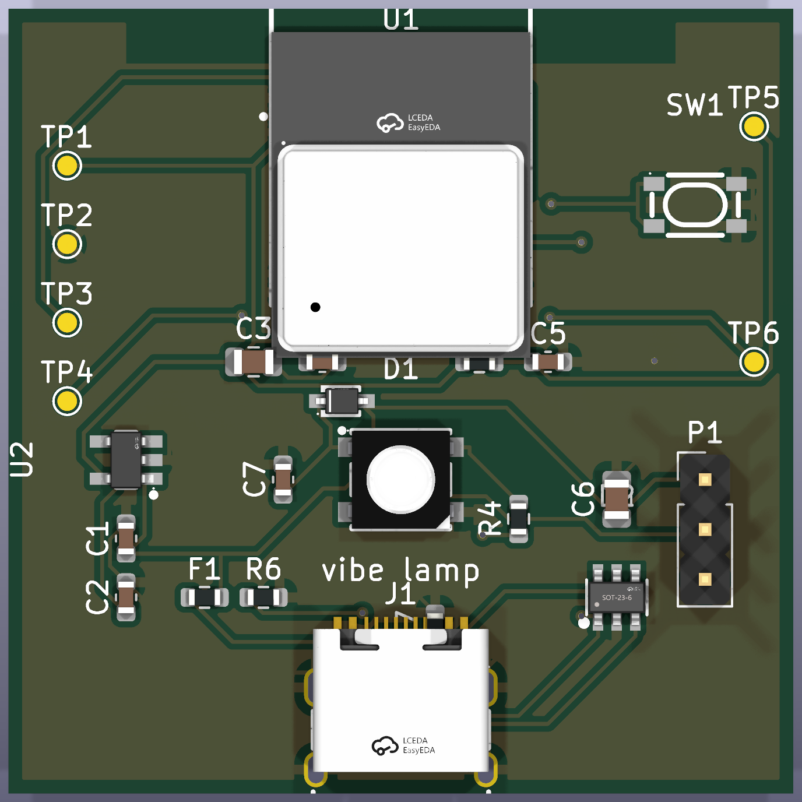

[English](README.md) | **简体中文**

# Vibe Lamp

AI 编码 agent 的实体状态灯。

Vibe Lamp 把本地编码 agent 的状态显示成桌面氛围光：蓝色表示干活中，绿色表示完成，红色表示需要你介入，琥珀色表示连接丢失。

<p align="center">
  
</p>

Core V1 是一块完整的 ESP32-C3 主控板：USB-C 供电/烧录、板载 WS2812B 状态灯、清网/配网按钮，并预留 WS2812 扩展焊盘。仓库内包含 KiCad 源文件、3D 渲染图、Gerber、BOM 和 CPL。

灵感来自 [Vibe Island](https://vibeisland.app/)，但不依赖它。Vibe Lamp 直接消费 agent hook，也可以和其他 hook consumer 共存。

---

## Agent 支持

| 级别 | Agent / 工具 | 接入方式 |
|---|---|---|
| 内置 | Claude Code、Codex | `daemon/install.py` 在 macOS 上安装本地 hook 和 launchd 自启。 |
| 通用 API | OpenCode、Qwen Code、Gemini CLI、Aider、Cursor、Windsurf、CodeBuddy / WorkBuddy、Trae、MarsCode / Doubao、Factory / Droid 类工具 | 只要能跑 hook、plugin、wrapper 或通知命令，就可以 POST 标准事件到 `/event/generic`。 |
| 后续专用适配 | 工具级集成 | 只改 Mac 端 daemon 的 adapter；ESP32 固件保持 agent 无关。 |

通用事件示例：

```bash
curl -s -o /dev/null --max-time 1 \
  -X POST http://127.0.0.1:8787/event/generic \
  -H 'Content-Type: application/json' \
  -d '{"agent":"opencode","session_id":"default","state":"working","tool":"code"}' || true
```

标准状态包括 `idle`、`working`、`done`、`error`、`needs_you`。适配说明见 [daemon/AGENTS.md](daemon/AGENTS.md)。

---

## 架构

所有判断逻辑都在 Mac 端，ESP32 只负责显示。

```text
Claude Code / Codex / 通用 agent
        │
        ▼
Mac daemon
  - 归一化 hook 事件
  - 合并多个会话
  - 推送状态 + 心跳
        │ WiFi / HTTP
        ▼
ESP32 firmware
  - 渲染 LED 颜色/动效
  - 心跳停止后进入失联态
```

单灯合并优先级：

```text
needs_you > error > working > done > idle
```

灯不会冻结在旧状态：daemon 或网络消失后，固件会在看门狗超时后切到琥珀色失联态。

---

## 硬件

支持两条硬件路径：

| 路径 | 适合 | 说明 |
|---|---|---|
| Core V1 PCBA | 成品构建 | 推荐路径。工厂贴片 ESP32-C3 主板，板载 WS2812B。 |
| 面包板原型 | 调试和实验 | ESP32 开发板 + RGB LED 或 WS2812 灯环。 |

<p align="center">
  
</p>

Core V1 生产文件在 [hardware/kicad/vibe_lamp_core_v1](hardware/kicad/vibe_lamp_core_v1)：

- KiCad PCB 源文件
- PCB 渲染图
- JLCPCB Gerber zip
- JLCPCB BOM 和 CPL

<details>
<summary>面包板原型物料</summary>

RGB LED 原型：

| 物料 | 数量 | 备注 |
|---|---:|---|
| ESP32 开发板 | 1 | 兼容 `esp32dev` 即可 |
| 共阴 RGB LED | 1 | 4 脚 LED |
| 220 欧姆电阻 | 3 | R/G/B 每路一颗 |
| 面包板 | 1 | 调试用 |
| 杜邦线 | 若干 | 按开发板选择 |
| USB 数据线 | 1 | 供电和烧录 |

WS2812 灯环原型：

| 物料 | 数量 | 备注 |
|---|---:|---|
| ESP32 开发板 | 1 | 同一套固件 |
| WS2812 / WS2812B 灯环 | 1 | 默认 16 颗灯 |
| 330 欧姆电阻 | 1 | 串在 DIN 上 |
| 1000 uF 电解电容 | 1 | 并在 5V 和 GND 之间 |
| 杜邦线 + USB 数据线 | 若干 | 供电、数据、烧录 |

</details>

详细接线、烧录、WiFi 配网和自测步骤见 [HARDWARE.md](HARDWARE.md)。

---

## 快速上手

```bash
# Core V1 固件
cd firmware
pio run -e c3_core_v1 -t upload

# Mac daemon + Claude Code / Codex hook
cd ../daemon
python install.py install
```

配网后可直接测试灯：

```bash
curl --noproxy '*' -X POST http://vibelamp-<id>.local/state \
  -H 'Content-Type: application/json' \
  -d '{"sessions":[{"state":"working","tool":"code"}]}'
```

---

## 开发

```bash
# Daemon 测试
cd daemon
python -m pytest

# 固件逻辑测试
cd ../firmware
pio test -e native

# 固件构建
pio run -e c3_core_v1
pio run -e esp32
pio run -e esp32_ring
```

`pio` 可使用仓库虚拟环境：`.venv/bin/pio`。

---

## 状态

已完成：

- ESP32 固件：WiFi 配网、HTTP 状态 API、mDNS、看门狗失联态、RGB/WS2812 显示驱动、动效、多会话显示。
- macOS daemon：Claude Code 和 Codex hook、通用事件 API、会话合并、心跳、重试、重发现、launchd 自启。
- Core V1 硬件：KiCad 主板源文件、渲染图、JLCPCB Gerber/BOM/CPL。

计划：

- 更多编码 agent 的专用 adapter。
- OTA 固件升级。
- 手机控制页面。
- 外壳和扩散罩打磨。
- WiFi 不可用时的 BLE 兜底。

---

## 仓库结构

```text
vibe-lamp/
├── hardware/    # Core V1 文档、KiCad 源文件、渲染图、生产文件
├── firmware/    # ESP32 固件、PlatformIO env、native 测试
├── daemon/      # macOS daemon、hook 安装器、归一化逻辑、pytest
└── scripts/     # 发布打包辅助脚本
```

---

## 许可证

MIT。见 [LICENSE](LICENSE)。
